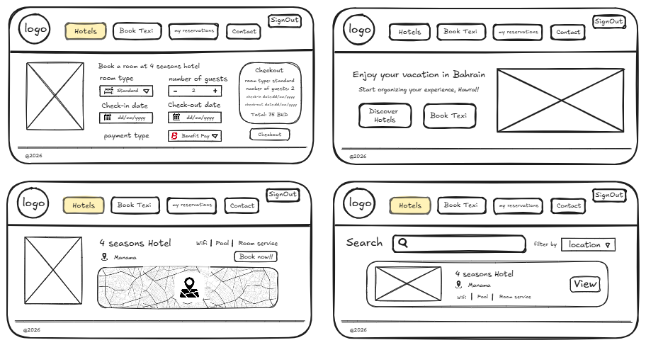
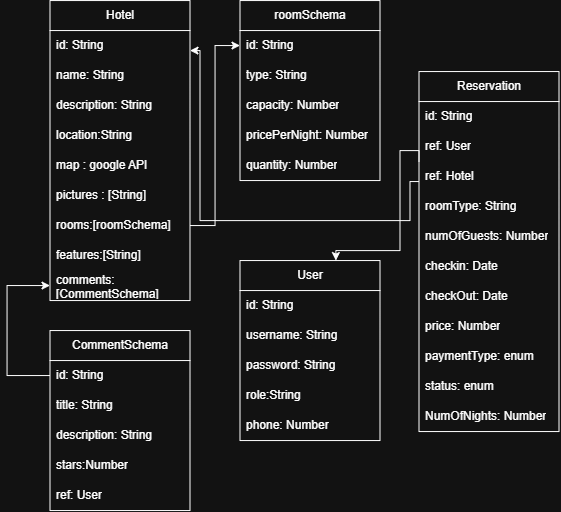

<h1>
  Hotel Booking Sysyem
</h1>

## User Stories:

### User(1): Customer
- I want to be able to search for all hotels and filter them based on location and price
- I want to be able to look up for the hotel details 
- I want to be able to reserve any available room in a hotel
- I want to be able to edit/delete my reservation at anytime
- I want to be able to see all my reservations list
- I want to be able to comment about my experince in the hotels
- I want to be able to book a taxi and cancel it at anytime

*future improvements:
- I want to be able to view places to visit (attractions,restaurants,entertianments)
### User(2): Admin
- I want to be able to add a new hotel
- I want to be able to show details of a hotel
- I want to be able to edit/delete a hotel

*future improvements:
- I want to be able to add/edit/delete places to visit (attractions,restaurants,entertianments)

## Initial protoypes:

## Entity Relationship Diagram:

